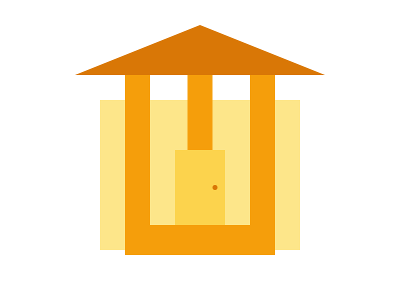

# Siddhartha Bank - Modern Banking Platform

  
  <h3>A Next.js Banking Platform Demo</h3>
  
Built with Next.js 14, TypeScript, Tailwind CSS, and MySQL

## 🌟 Features

- **Secure Authentication**
  - JWT-based authentication
  - Session management
  - Password encryption

- **Account Management**
  - Multiple account types (Savings, Current)
  - Real-time balance tracking
  - Transaction history

- **Money Transfers**
  - Instant transfers between accounts
  - Scheduled payments
  - Transaction categorization

- **Dashboard Analytics**
  - Spending patterns
  - Income tracking
  - Category-wise analysis

- **Modern UI/UX**
  - Responsive design
  - Dark mode support
  - Animated transitions

## 🛠️ Tech Stack

- **Frontend**
  - Next.js 14
  - TypeScript
  - Tailwind CSS
  - Framer Motion
  - Tremor Charts

- **Backend**
  - Next.js API Routes
  - MySQL
  - JWT Authentication
  - bcrypt

- **Development**
  - ESLint
  - Prettier
  - Husky
  - TypeScript

## 🚀 Getting Started

1. **Clone the repository**

2. **Install dependencies**

3. **Set up MySQL database**

4. **Run the development server**

bash
npm run dev
or
yarn dev

5. **Open [http://localhost:3000](http://localhost:3000)**

## 📝 Project Structure

siddharthabank/
├── src/
│ ├── app/ # Next.js 14 App Router
│ ├── components/ # Reusable components
│ ├── lib/ # Utilities and helpers
│ ├── types/ # TypeScript types
│ └── providers/ # Context providers
├── public/ # Static assets
└── prisma/ # Database schema

## 🔒 Security Features

- Password hashing with bcrypt
- JWT token authentication
- HTTP-only cookies
- SQL injection prevention
- XSS protection
- CSRF protection

## 🎨 UI Components

- Custom form components
- Responsive navigation
- Interactive charts
- Loading states
- Toast notifications
- Modal dialogs

## 📱 Screenshots

[Add your screenshots here]

## 🧪 Trial Project Information

This project was developed as a trial project for DevRoom, demonstrating:
- Modern web development practices
- Clean code architecture
- Secure authentication implementation
- Responsive UI/UX design
- Real-time data handling
- Database management

## 📄 License

This project is licensed under the MIT License - see the [LICENSE](LICENSE) file for details.

## 🙏 Acknowledgments

- [Next.js](https://nextjs.org/)
- [Tailwind CSS](https://tailwindcss.com/)
- [Tremor](https://www.tremor.so/)
- [MySQL](https://www.mysql.com/)

---

  
Developed with ❤️ by Sulcrus

  
Trial Project for DevRoom

